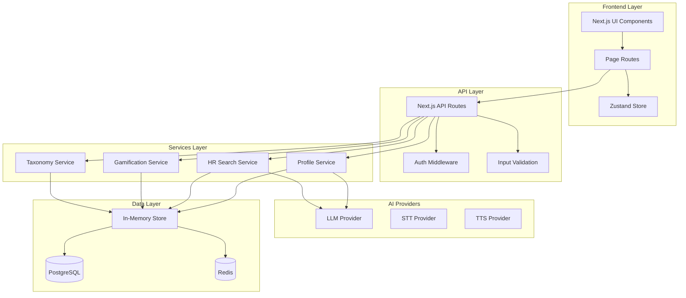

# 🏗 Архитектура PathFinder

## Обзор системы

PathFinder построен по принципам модульной архитектуры с четким разделением ответственности между слоями и компонентами.

## 📐 Архитектурные принципы

### 1. On-Premise First
- Все данные остаются в корпоративном контуре
- Внешние интеграции отключены по умолчанию
- Feature flags для контроля сетевых подключений

### 2. Provider Abstraction Pattern
- Единые интерфейсы для LLM, STT, TTS провайдеров
- Mock реализации для development
- Hot-swappable providers через конфигурацию

### 3. Security by Design
- RBAC на уровне маршрутов и компонентов
- Валидация всех входных данных
- Аудит всех критических операций

## 🏭 Диаграмма компонентов



## 🔧 Ключевые компоненты

### Frontend слой

#### Next.js App Router
- **Файловая маршрутизация** с автоматическим code splitting
- **SSG/SSR** для оптимизации производительности  
- **Middleware** для аутентификации и авторизации

#### State Management (Zustand)
```typescript
interface AppState {
  user: User | null
  currentRole: 'employee' | 'hr' | 'admin'
  chatMessages: ChatMessage[]
  voiceState: VoiceState
}
```

#### UI Components (shadcn/ui + Tailwind)
- Доступные компоненты с ARIA поддержкой
- Responsive design из коробки
- Темизация через CSS переменные

### API слой

#### RESTful Endpoints
```
GET    /api/profile          - Получить профиль
PUT    /api/profile          - Обновить профиль  
GET    /api/roles            - Список ролей
POST   /api/hr/search        - Поиск кандидатов
GET    /api/admin/audit      - Аудит логи
```

#### Middleware Stack
1. **CORS** - Cross-origin policy
2. **Auth** - JWT/Session validation  
3. **RBAC** - Role-based access control
4. **Rate Limiting** - API abuse protection
5. **Validation** - Request/response schemas

### Services слой

#### LLM Service Abstraction
```typescript
interface ILLMClient {
  chat(context: string, messages: ChatMessage[]): Promise<string>
  recommendRoles(profile: Profile): Promise<AIRecommendation[]>
  matchCandidates(jobDesc: string, candidates: User[]): Promise<CandidateMatch[]>
  explainMatch(candidate: User, jobDesc: string): Promise<MatchExplanation>
}

class SciboxLLMClient implements ILLMClient {
  // Production implementation for Scibox
}

class MockLLMClient implements ILLMClient {
  // Mock implementation for development
}
```

#### Voice Services
```typescript
interface ISTTClient {
  transcribe(audioData: Blob): Promise<string>
  isAvailable(): boolean
  getSupportedLanguages(): string[]
}

interface ITTSClient {
  synthesize(text: string, options?: TTSOptions): Promise<Blob>
  getAvailableVoices(): Promise<Voice[]>
  isAvailable(): boolean
}
```

## 🔐 Безопасность

### Аутентификация
```typescript
// Mock SSO для demo
class MockSSOProvider {
  authenticate(role: UserRole): Promise<User>
}

// Production SSO 
class SAMLSSOProvider {
  authenticate(samlResponse: string): Promise<User>
}
```

### Авторизация (RBAC)
```typescript
const permissions = {
  employee: ['view:own_profile', 'update:own_profile', 'view:recommendations'],
  hr: ['view:all_profiles', 'search:candidates', 'view:analytics'],
  admin: ['manage:taxonomy', 'view:audit', 'manage:config']
}
```

### Аудитирование
```typescript
interface AuditLogEntry {
  id: string
  userId: string
  action: string
  resource: string
  timestamp: Date
  metadata: Record<string, any>
}
```

## 📊 Данные

### Модель данных
```typescript
// Основные сущности
User -> Profile -> Skills[]
Role -> RequiredSkills[]
Vacancy -> Requirements[]  
Quest -> Objectives[]
Badge -> Criteria[]
```

### Слой персистентности
```typescript
interface Repository<T> {
  findById(id: string): Promise<T | null>
  findAll(filter?: FilterOptions): Promise<T[]>
  save(entity: T): Promise<T>
  delete(id: string): Promise<void>
}

// Implementations
class InMemoryRepository<T> implements Repository<T> // Development
class PostgreSQLRepository<T> implements Repository<T> // Production
```

## 🤖 ИИ интеграция

### Контекстные провайдеры
```typescript
class ContextualAIProvider {
  // Разные контексты для разных ролей
  getEmployeeContext(user: User): AIContext
  getHRContext(searchContext: SearchContext): AIContext  
  getAdminContext(systemState: SystemState): AIContext
}
```

### Объяснимость (XAI)
```typescript
interface MatchExplanation {
  score: number
  matchedSkills: SkillMatch[]
  missingSkills: SkillGap[]
  recommendations: ActionableRecommendation[]
  confidence: number
}
```

## 🚀 Развертывание

### Docker архитектура
```yaml
services:
  app:
    build: .
    ports: ["3000:3000"]
    depends_on: [db, redis]
    
  db:
    image: postgres:15
    volumes: ["postgres_data:/var/lib/postgresql/data"]
    
  redis: 
    image: redis:7-alpine
    
  nginx:
    image: nginx:alpine
    ports: ["80:80", "443:443"]
```

### Kubernetes готовность
- Health checks и readiness probes
- Horizontal Pod Autoscaling (HPA)
- ConfigMaps для конфигурации
- Secrets для sensitive данных

## 📈 Производительность

### Кеширование стратегии
```typescript
// Redis для session и API cache
const cacheStrategy = {
  profiles: { ttl: 3600 }, // 1 час
  recommendations: { ttl: 1800 }, // 30 мин
  search: { ttl: 600 } // 10 мин
}
```

### Database оптимизации
```sql
-- Индексы для быстрого поиска
CREATE INDEX idx_user_skills ON user_skills(skill_id, level);
CREATE INDEX idx_profile_completeness ON profiles(completeness_score);
CREATE INDEX idx_audit_logs_timestamp ON audit_logs(created_at);
```

## 🔄 Интеграционная готовность

### Webhook система
```typescript
interface WebhookEvent {
  type: 'profile.updated' | 'role.assigned' | 'quest.completed'
  payload: any
  timestamp: Date
}

class WebhookDispatcher {
  async dispatch(event: WebhookEvent): Promise<void>
}
```

### API versioning
```
/api/v1/profiles  - Current stable API
/api/v2/profiles  - Next version with new features
```

## 🧪 Тестирование

### Архитектура тестов
```
tests/
├── unit/          # Изолированные unit тесты
├── integration/   # API и service тесты  
├── e2e/          # End-to-end сценарии
└── load/         # Performance тесты
```

### Mock стратегии
```typescript
// Dependency injection для тестирования
class ServiceContainer {
  register<T>(token: string, implementation: T): void
  resolve<T>(token: string): T
}

// В тестах используем mock implementations
container.register('LLMClient', new MockLLMClient())
```

## 📋 Мониторинг

### Observability
```typescript
// Structured logging
const logger = {
  info: (message: string, meta?: object) => void
  error: (message: string, error: Error, meta?: object) => void
  audit: (action: string, user: string, meta?: object) => void
}

// Metrics collection  
const metrics = {
  counter: (name: string, value: number) => void
  histogram: (name: string, value: number) => void
  gauge: (name: string, value: number) => void
}
```

### Health checks
```typescript
interface HealthCheck {
  name: string
  check(): Promise<HealthStatus>
}

class DatabaseHealthCheck implements HealthCheck {
  async check(): Promise<HealthStatus> {
    // Проверка подключения к БД
  }
}
```

## 🔮 Roadmap

### Phase 2: Enhanced AI
- Multi-modal AI (text + voice + documents)
- Continuous learning from user feedback
- Advanced recommendation engines

### Phase 3: Enterprise Scale
- Multi-tenant architecture
- Advanced RBAC with custom roles
- Enterprise-grade audit and compliance

### Phase 4: Ecosystem
- Plugin architecture for third-party extensions
- Marketplace for HR tools and integrations
- Advanced analytics with ML insights

## 📚 Дополнительные ресурсы

- [API Documentation](./API.md)
- [Deployment Guide](./DEPLOYMENT.md)  
- [Security Best Practices](./SECURITY.md)
- [Performance Tuning](./PERFORMANCE.md)
